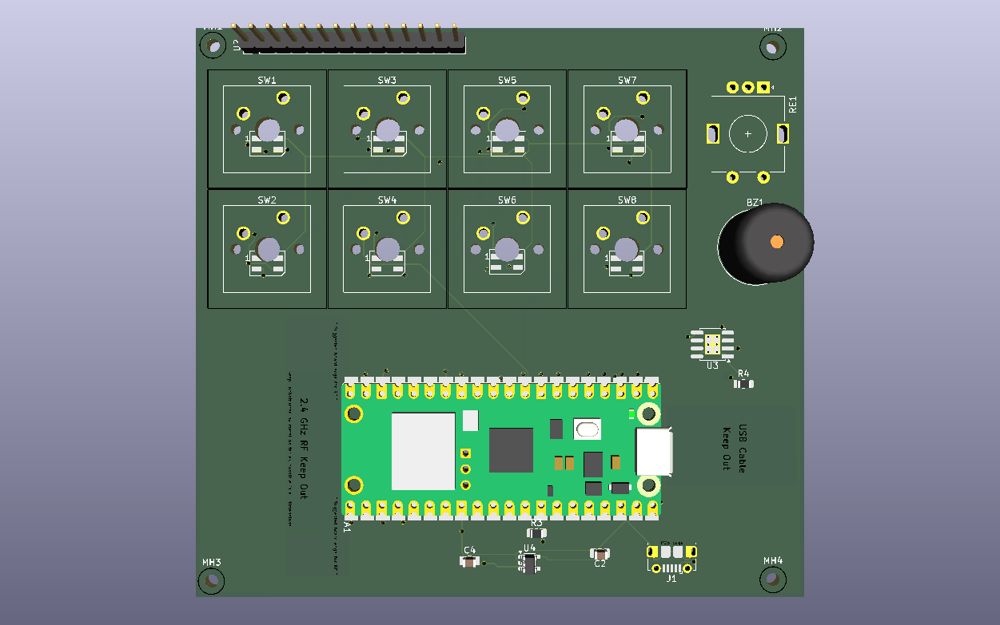

# Oxide Keys

A mini game console with 8 keys and a display, which has the ability to play very simple games to kill time and also a fun way to integrate Rust (the language I am learning).
The hardware is mainly composed of an 8-key mini game player with rotary encoder, LCD display that folds on a hinge, and RGB underglow on the Raspberry Pi Pico W, where I aim to include as much Rust as I can in this project.

## Demo
No physical build yet but the image above shows the PCB board to be made.

## Quickstart
Hardware was made on KiCad, with the PCB board and schematics, you can open hardware/pcb to view this. The cargo build was made from firmware and can be cargo built, cd firmware && cargo build. Also the Cad enclosure utilises the mount standoffs instead of being 3d in enclosure/

## Features that I will implement
- The switches are designed so that each key is important in navigating the screen where I want to create a launcher which you can scroll through a section of simple games similar to pong and space invader that I create. These keys will be assigned certain roles in the future such as selecting, navigation (mimicking the hjkl keys etc), and the amount of keys allows a wide use-case in games that I will develop specifically for this device.
- The lights underneath the keys will be an amber glow until pressed in which they will react in a white colour once pressed.
- Want the encoder knob to be used to scroll on the idle screen/Launcher.

## Design
- Uses a pico W as the controller.
- firmware stack includes embedded hal, probers and rp2040 hal. It lives in firmware/ and builds with cargo build
- display sits on a hinge now
- fullparts list is in the BOM.csv -> 117 USD.
- the cad enclosure that I am incorporating uses a 2d laser cut acrylic with mounted standoffs in between. Meaning that I can still incorporate cool aesthetics with the layer being transparent on purpose.

## Todo
The potential of the encoder knob in some games is something I want to explore.

## How it works
Will explain once started build.

## Credits
credits to stardance for inspo + help.
