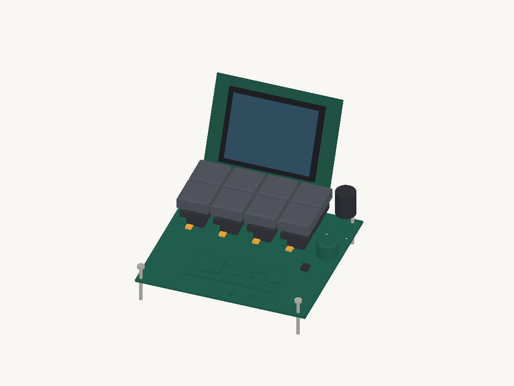
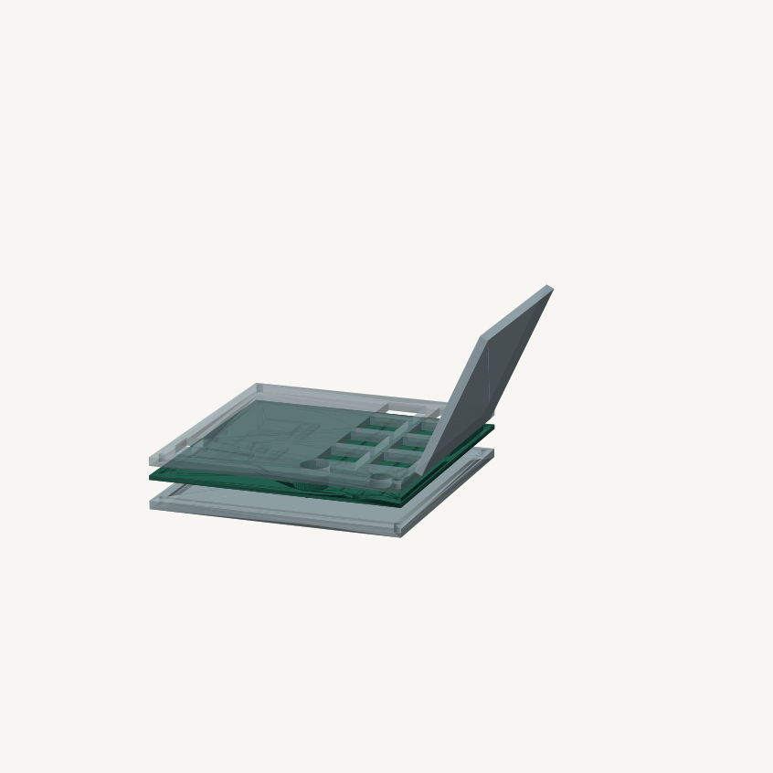
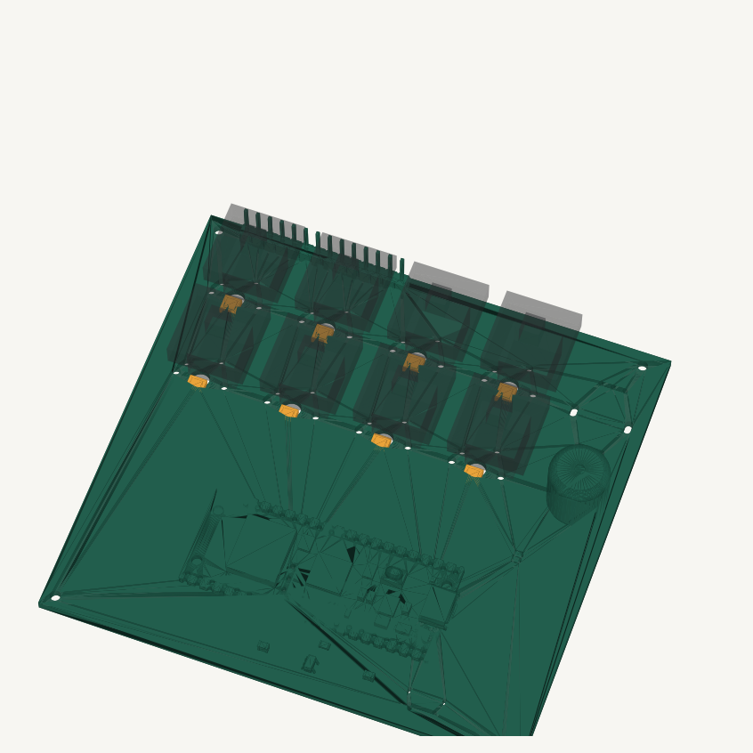

# Oxide Keys

A mini game console with 8 keys and a display, which has the ability to play very simple games to kill time and also a fun way to integrate Rust (the language I am learning).
The hardware is mainly composed of an 8-key mini game player with rotary encoder, LCD display that folds on a hinge, and RGB underglow on the Raspberry Pi Pico W, where I aim to include as much Rust as I can in this project.

## CAD views

[Assembly STEP](production/cad/OxideKeys-review-assembly-detailed.step) · [Enclosure SVG](enclosure/Oxidekeysenclosure.svg) · [Gerbers](production/gerbers.zip) · [Firmware UF2](production/firmware/oxide-keys.uf2)

The assembly includes eight separately named Cherry MX2A Orange switch clearance models
(`SW1`–`SW8`) and eight SK6812MINI LED package models (`D1`–`D8`) at their
actual KiCad footprint positions. The last image omits the acrylic deck and
makes the switch housings transparent to show the LEDs; the downloadable STEP
keeps all parts at assembly height.
The LEDs sit toward one edge of each switch rather than directly under its stem.
These are review shapes, not manufacturer STEP models. The BOM purchases spare
switches and LEDs; only eight of each go on the board.

This is still an incomplete physical assembly: the BOM's particular display
module, keycaps, encoder knob, battery, charging module, hinges and fasteners
have not been fitted as verified part models. The 3 mm acrylic switch mounting,
LED light path and display/hinge clearance need a physical fit check before
cutting or claiming the build is ready to assemble.

## Demo
No physical build yet but the image above shows the PCB board to be made.

## Quickstart
Hardware was made on KiCad, with the PCB board and schematics, you can open hardware/pcb to view this. The cargo build was made from firmware and can be cargo built, cd firmware && cargo build. Also the Cad enclosure utilises the mount standoffs instead of being 3d in enclosure/

## Features that I will implement
- The switches are designed so that each key is important in navigating the screen where I want to create a launcher which you can scroll through a section of simple games similar to pong and space invader that I create. These keys will be assigned certain roles in the future such as selecting, navigation (mimicking the hjkl keys etc), and the amount of keys allows a wide use-case in games that I will develop specifically for this device.
- The lights underneath the keys will be an amber glow until pressed in which they will react in a white colour once pressed.
- Want the encoder knob to be used to scroll on the idle screen/Launcher.

## Design
- Uses a pico W as the controller.
- firmware stack includes embedded hal, probers and rp2040 hal. It lives in firmware/ and builds with cargo build
- display sits on a hinge now
- fullparts list is in [BOM.csv](BOM.csv).
- the cad enclosure that I am incorporating uses a 2d laser cut acrylic with mounted standoffs in between. Meaning that I can still incorporate cool aesthetics with the layer being transparent on purpose.

## Todo
The potential of the encoder knob in some games is something I want to explore.

## Credits
credits to stardance for inspo + help.
