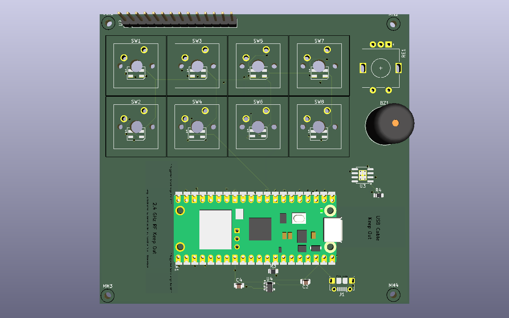
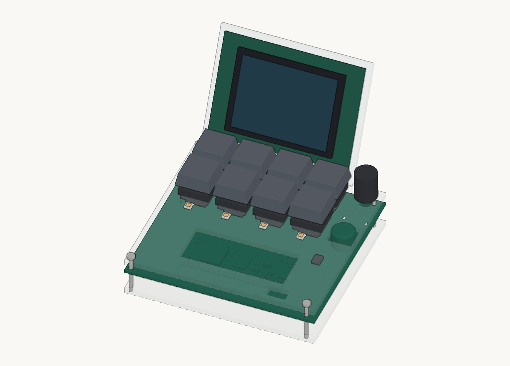
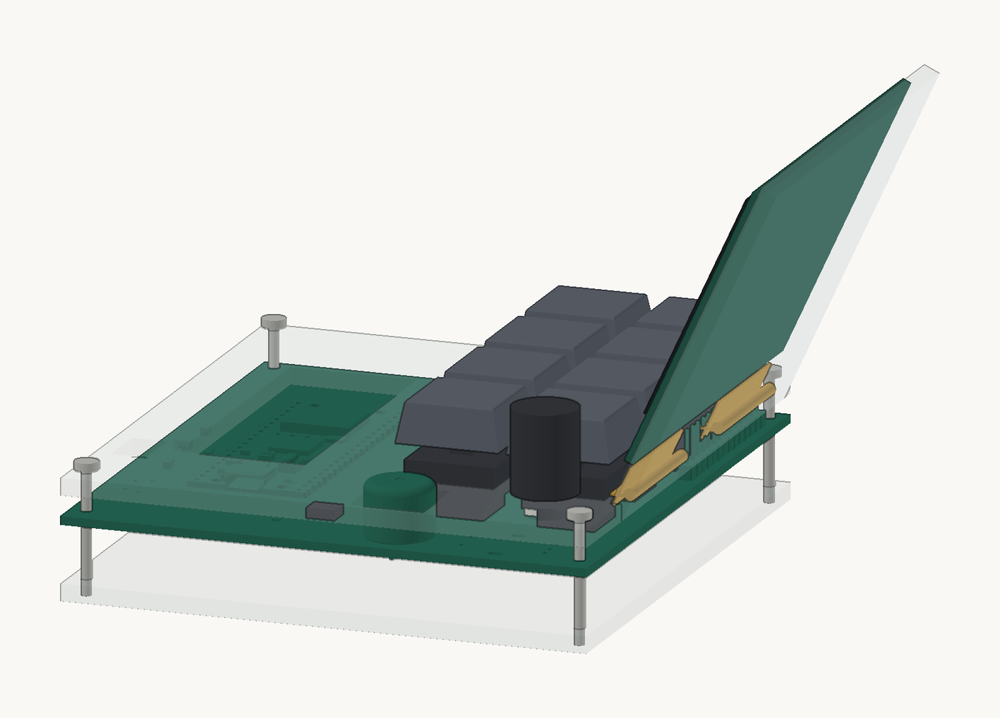
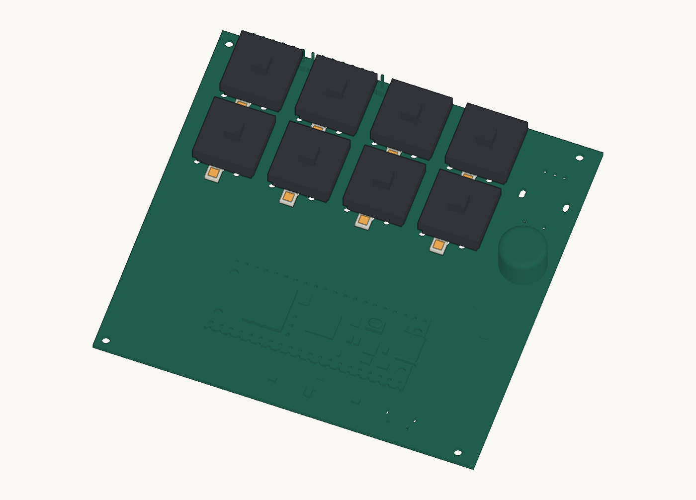
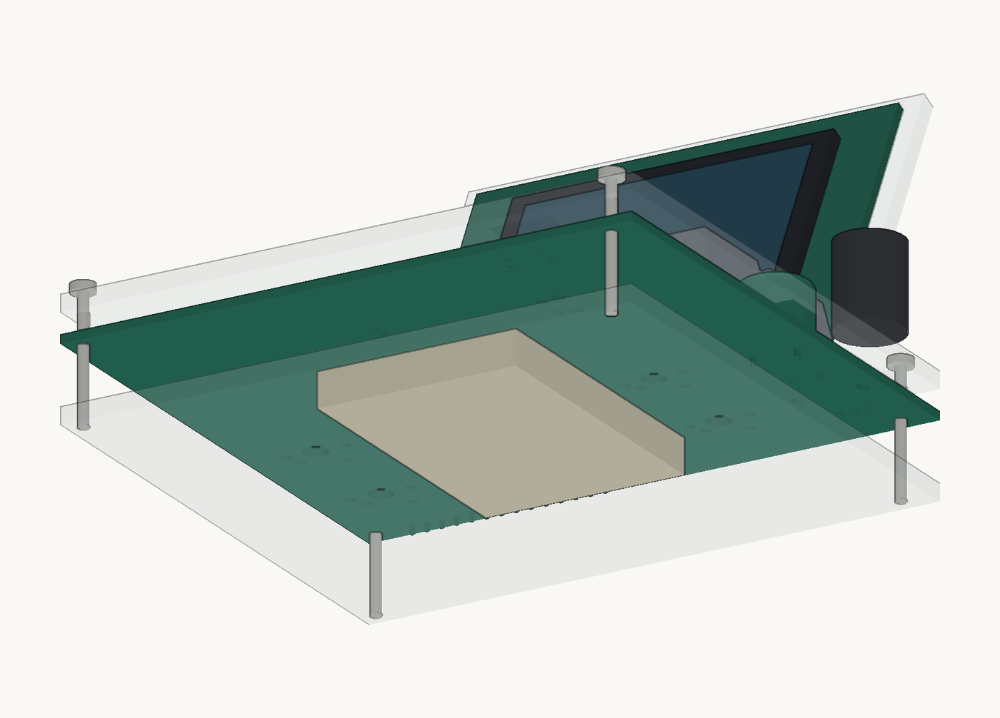

# Oxide Keys

A mini game console with 8 keys and a display, which has the ability to play very simple games to kill time and also a fun way to integrate Rust (the language I am learning).

The hardware is mainly composed of an 8-key mini game player with rotary encoder, LCD display that folds on a hinge, and RGB underglow on the Raspberry Pi Pico W, where I aim to include as much Rust as I can in this project.

## CAD views

[Assembly STEP](cad/OxideKeys-review-assembly-detailed.step) · [Enclosure SVG](cad/Oxidekeysenclosure.svg)

## Demo
No physical build yet but the image above shows the PCB board to be made.

## Quickstart
Hardware was made on KiCad, with the PCB board and schematics, you can open pcb to view this. The cargo build was made from firmware and can be cargo built, cd firmware && cargo build. Also the Cad enclosure utilises the mount standoffs instead of being 3d in enclosure/

## Features that I will implement
- The switches are designed so that each key is important in navigating the screen where I want to create a launcher which you can scroll through a section of simple games similar to pong and space invader that I create. These keys will be assigned certain roles in the future such as selecting, navigation (mimicking the hjkl keys etc), and the amount of keys allows a wide use-case in games that I will develop specifically for this device.
- The lights underneath the keys will be an amber glow until pressed in which they will react in a white colour once pressed.
- Want the encoder knob to be used to scroll on the idle screen/Launcher.

## Design
- Uses a pico W as the controller.
- firmware stack includes embedded hal, probers and rp2040 hal. It lives in firmware/ and builds with cargo build
- display sits on a hinge now
- fullparts list is in [BOM.csv](BOM.csv).
- the cad enclosure that I am incorporating uses a 2d laser cut acrylic with mounted standoffs in between. Meaning that I can still incorporate cool aesthetics with the layer being transparent on purpose.

## Todo
The potential of the encoder knob in some games is something I want to explore.

## Credits
credits to stardance for inspo + help.

## Bill of materials

The source BOM with supplier links is in [BOM.csv](BOM.csv).

| Part | Quantity | Price AUD | Supplier | Link |
| --- | ---: | ---: | --- | --- |
| Raspberry Pi Pico W | 1 | 9.90 | Core Electronics | [link](https://core-electronics.com.au/raspberry-pi-pico-w-wireless-wifi.html) |
| Piezo Buzzer | 1 | 0.34 | Core Electronics | [link](https://core-electronics.com.au/piezo-buzzer.html) |
| LiPo Battery 3.7V 1100mAh | 1 | 10.15 | Tempero Systems | [link](https://temperosystems.com.au/products/603450-lithium-ion-polymer-battery-lipo-3-7v-1100mah/) |
| Core Electronics Shipping | 1 | 7.00 | Core Electronics | [link](https://core-electronics.com.au/policies-faq) |
| Cherry MX2A Orange Switch pack (10x) | 1 | 6.50 | Mechstock | [link](https://www.mechstock.com.au/products/cherry-mx2a-orange) |
| Mechstock Shipping | 1 | 7.50 | Mechstock | [link](https://www.mechstock.com.au/pages/shipping-policy-2025) |
| Rotary Encoder Switch (SR1230) | 1 | 10.25 | Jaycar | [link](https://www.jaycar.com.au/rotary-encoder-switch-with-pushbutton/p/SR1230) |
| Silicone Wire 2m (28AWG Red + Black) | 1 | 4.95 | Amazon AU | [link](https://www.amazon.com.au/Ozchillon-28AWG-Flexible-Silicone-Black/dp/B0FTVY5H6M) |
| Pin Header Strip 40-way (M+F) | 1 | 2.95 | Jaycar | [link](https://www.jaycar.com.au/pcb-pins-and-headers/c/1HJ) |
| 1N4148 Diode Pack (5x) | 1 | 0.95 | Jaycar | [link](https://www.jaycar.com.au/1n4148-1n914-signal-diode-pack-of-5/p/ZR1100) |
| 2.4" TFT LCD Touch Display (ILI9341) | 1 | 10.00 | Createunsw | [link](https://store.createunsw.com.au/2-4-arduino-touchscreen-module) |
| M2 Nylon Standoff Kit (180pc) | 1 | 15.00 | Amazon AU | [link](https://www.amazon.com.au/Aolidsive-Standoff-Assortment-Motherboard-Projects/dp/B0GYBV21GF) |
| Clear Acrylic Sheet A5 3mm | 2 | 8.96 | Amazon AU | [link](https://www.amazon.com.au/Clear-Acrylic-Sheet-3mm-Thickness/dp/B0F4PN42ZM) |
| Knurled Encoder Knob (2pc) | 1 | 7.34 | Core-electronics | [link](https://core-electronics.com.au/slim-rubber-rotary-encoder-knob-11-5mm-x-14-5mm-d-shaft.html) |
| N3UD PBT Blank Keycaps 1U XDA Profile (20pc) | 1 | 7.00 | AliExpress | [link](https://www.aliexpress.com/w/wholesale-n3ud-20pcs-pbt-blank-keycap-xda.html) |
| Amazon AU Shipping (order remaining Amazon items together) | 1 | 0.00 | Amazon AU | [link](https://www.amazon.com.au/) |
| SK6812MINI RGB LED pack (x20) | 2 | 3.00 | KEEBD | [link](https://keebd.com/products/sk6812mini-rgb-led) |
| KEEBD Shipping | 1 | 9.59 | KEEBD | [link](https://keebd.com/) |
| TP4056 Li-ion Charger IC (harvest from domestic TP4056 module) | 1 | 3.99 | Tempero Systems | [link](https://temperosystems.com.au/products/tp4056-mini-usb-1a-5v-lithium-battery-charger-copy/) |
| AP2112K-3.3 LDO Regulator | 1 | 5.23 | Amazon AU | [link](https://www.amazon.com.au/) |
| 330 Ohm 0805 Resistor pack (10x) | 1 | 1.40 | Altronics | [link](https://www.altronics.com.au/electronic-components/carbon-film-resistors/?prdv=330R) |
| 1uF 0805 Capacitor pack (50x) | 1 | 13.95 | Phipps Electronics | [link](https://www.phippselectronics.com/product/16v-1uf-0805-ceramic-smd-capacitor-pack-of-50/) |
| Brass Hinges (2-pack) | 1 | 7.94 | Bunnings | [link](https://www.bunnings.com.au/prestige-15-x-25-x-0-5mm-decorative-brass-hinges_p3968293) |
| Bunnings Shipping | 1 | 0.00 | Bunnings | [link](https://www.bunnings.com.au/) |
| TOTAL (including PCB fabrication) |  | 161.79 |  |  |
| JLCPCB 4-Layer PCB Fab | 1 | 13.00 | JLCPCB | [link](https://jlcpcb.com/) |
| --- Optional, not counted above --- |  |  |  |  |
| Desertcart M2 Mounting Screw Kit (60pc) | 1 | 10.00 | Desertcart Australia | [link](https://www.desertcart.com.au/products/600128736-m2-ssd-screws-kit-pcie-nvme-m-2-ssd-mounting) |
| Soldering Iron Kit (optional) | 1 | 25.00 | Amazon AU | [link](https://www.amazon.com.au/Soldering-Iron-Kit-Rechargeable-Temperature/dp/B0DYH7QMYK) |
